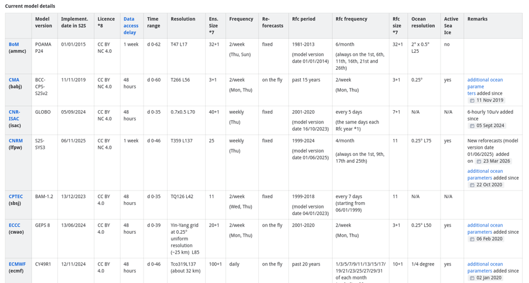

Models
=================================

.. important::
    This is a tool being developed by the ACACIA project. Please email feedback to joshua.talib@ecmwf.int.

Available models
-------------------

A full summary of models can be found on the ECMWF `confluence page <https://confluence.ecmwf.int/display/S2S/Models>`_.  An example is shown below:

Image: where to find helpful information about the models available in the ECMWF database.  This is an example; please visit the link above for up-to-date 'live' information.

Model Characteristics
-----------------------

The models differ from eachother in many ways, including: 

- **Forecast frequency**: All models are initialised on a Thursday.  Beyond that, met services will vary when they initialise again on different days, with different frequencies. 
- **Ensemble size**: Ensemble size varies across models. 
- **Data access delay**: Models vary by the delay in accessing data.

Model Selection
-------------------

Use the following syntax to select your desired model (example model below is ECMWF):

.. code-block:: python

   download_forecast(variable, model='ECMWF')
   
ECMWF has the most ensemble members so will be selected as the default model if no model is specified by the user.
    

