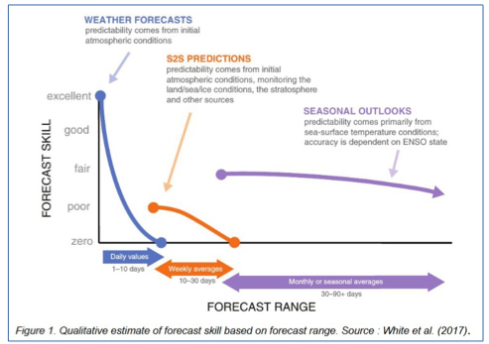

What is Subseasonal Forecasting?
=================================

.. important::
    This is a tool being developed by the ACACIA project. Please email feedback to k.bartholomew@metoffice.co.uk

What is Subseasonal Forecasting?
---------------------------------

A weather forecast takes initial atmospheric conditions such as temperature, pressure, and wind speed and uses a dyamical model to predict how those conditions will evolve over time.  This relies on accurate knowledge of initial atmospheric conditions, which can never be perfect, so weather forecasts lose useful skill beyond a lead time of about 5-10 days.

A seasonal forecast relies on slowly varying components of the Earth system that can influence atmospheric behaviour over many months, such as ENSO, sea-ice extent, and sea surface temperature. Although this does not provide a precise prediction of atmospheric conditions at a particular time, it does allow forecasters to estimate which atmospheric conditions might be more likely over the next 1-3 months.

Sub-seasonal timescales (2 weeks to 2 months) fall into the predictability gap between weather and seasonal forecasting, where users need more precise information than a seasonal forecast but there is no weather forecasting skill. S2S forecasting bridges this gap by combining dynamical models with information from slowly evolving components of the Earth system, such as the MJO, soil moisture, snow cover, and stratospheric variability.

